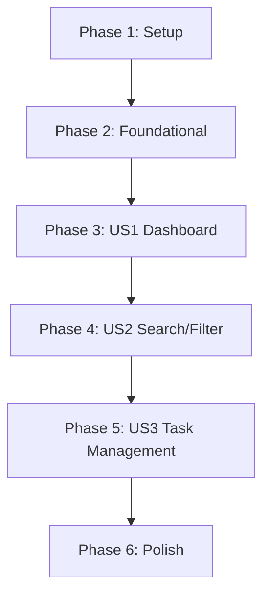

# Tasks: UI Redesign

**Feature**: UI Redesign
**Plan**: [plan.md](plan.md)
**Branch**: `004-ui-redesign`

## Phase 1: Setup

- [x] T001 [P] Configure Inter font and background colors in `frontend/app/layout.tsx`
- [x] T002 [P] Define Soft UI shadow and animation utilities in `frontend/app/globals.css`
- [x] T003 [P] Remove/Disable existing Dark Mode logic in `frontend/components/ThemeProvider.tsx` and related files

## Phase 2: Foundational

- [x] T004 [P] Update `useTasks.ts` with `searchQuery` and `activeFilter` state and logic in `frontend/hooks/useTasks.ts`
- [x] T005 [P] Implement `StatsCards` component with dynamic count logic in `frontend/components/tasks/StatsCards.tsx`
- [x] T006 [P] Implement `SearchBar` component with real-time input handling in `frontend/components/tasks/SearchBar.tsx`
- [x] T007 [P] Implement `FilterTabs` component (All, Completed, Pending, High Priority) in `frontend/components/tasks/FilterTabs.tsx`

## Phase 3: User Story 1 - Modernized Dashboard Experience (P1)

**Story Goal**: Transform the dashboard with Soft UI aesthetics and dynamic stats.

- [x] T008 [US1] Redesign `Navbar.tsx` with "My Tasks" branding and soft shadow in `frontend/components/layout/Navbar.tsx`
- [x] T009 [US1] Update `dashboard/page.tsx` to include `StatsCards`, `SearchBar`, and `FilterTabs` in `frontend/app/dashboard/page.tsx`
- [x] T010 [US1] Integrate `StatsCards` into the main dashboard layout in `frontend/app/dashboard/page.tsx`

**Independent Test**: Dashboard displays Soft UI cards with accurate task counts. Layout is responsive on 375px.

## Phase 4: User Story 2 - Real-time Task Search and Filtering (P1)

**Story Goal**: Enable users to instantly find and filter tasks.

- [x] T011 [US2] Integrate `SearchBar` and `FilterTabs` into the dashboard layout in `frontend/app/dashboard/page.tsx`
- [x] T012 [US2] Pass search and filter state from dashboard to `TaskList` or `useTasks` hook in `frontend/app/dashboard/page.tsx`
- [x] T013 [US2] Update `TaskList` to use filtered results from the hook in `frontend/components/tasks/TaskList.tsx`

**Independent Test**: Typing in search bar filters list instantly. Clicking filter tabs (e.g., "Completed") updates list correctly.

## Phase 5: User Story 3 - Task Organization and Management (P2)

**Story Goal**: Redesign task cards and management inputs.

- [x] T014 [US3] Create `AddTaskInput` component with priority pills and due date trigger in `frontend/components/tasks/AddTaskInput.tsx`
- [x] T015 [US3] Overhaul `TaskCard` with left priority bar, circular checkbox, and Soft UI shadows in `frontend/components/tasks/TaskCard.tsx`
- [x] T016 [US3] Implement pinned task sorting logic (pinned at top) in `frontend/components/tasks/TaskList.tsx`
- [x] T017 [US3] Redesign `TaskModal` with 2-column layout and Soft UI style in `frontend/components/tasks/TaskModal.tsx`

**Independent Test**: New tasks can be added via the redesigned input. Cards show priority bars. Pinned tasks stay at top.

## Phase 6: Polish & Cross-Cutting Concerns

- [x] T018 [P] Redesign Login page with Soft UI cards in `frontend/app/login/page.tsx`
- [x] T019 [P] Redesign Signup page with Soft UI cards in `frontend/app/signup/page.tsx`
- [x] T020 [P] Update `UndoToast` with new slide animations and Soft UI style in `frontend/components/tasks/UndoToast.tsx`
- [x] T021 Final verification of all 73 existing tests and Lighthouse accessibility audit

## Implementation Strategy

- **MVP First**: Phases 1-3 establish the core "look and feel" and dashboard metrics.
- **Incremental Delivery**: Phases 4 and 5 add the improved interactivity and task management.
- **Parallel Opportunities**: Components (T005-T007) can be developed in parallel once the hook logic (T004) is ready.

## Dependency Graph

